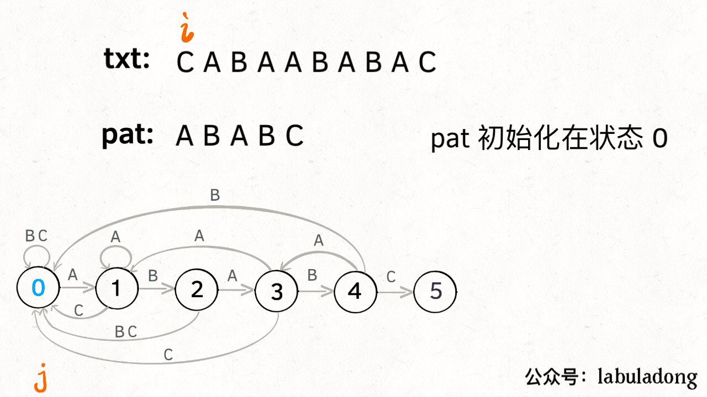

## KMP算法概述
### &ensp; &ensp; KMP算法是一种子字符串查找算法。KMP算法的基本思想是当出现不匹配时，就能知晓一部分文本的内容，我们可以利用这些信息避免将指针回退到所有这些已知的字符之前。
### &ensp; &ensp; 如果用暴力算法解决搜索子字符串问题 ，当出现不匹配时会回退到i+1，浪费了已知的信息。
<br>
(txt为被搜索的文本，pat为模式字符串即想要搜索的字符)
### 而KMP算法很聪明，他能知道应该回退到哪一步:
<br>
但是KMP算法是如何知道该退到哪一步的呢？这是因为KMP算法有一个**确定有限状态机**。每个模式字符串都只有唯一的一个**确定有限状态机**，和要搜索的文本没有关系。举个例子：
```
txt1 = "aaacaaab" 
pat = "aaab"
txt2 = "aaaaaaab" 
pat = "aaab"
```
txt 不同，但是 pat 是一样的，所以 KMP 算法使用的**确定有限状态机**是同一个。
**确定有限状态机**简写为dfa，我们只要构建一个dfa数组就能知道该回退到哪一个状态。
## 确定有限状态机
### &ensp;&ensp;我们可以把模式字符串划分为不同的几个状态。比如字符串pat = 'ABABAC'，就如下图，圆圈内数字是状态，箭头表示当前状态匹配到这个字符时候就能进入下一个状态。
 
比如处在状态2时当前匹配到的字符是'AB' 当下一个字符是'A'时就进入状态3.但是如果不是'A'呢？那就要回退了。

如上图所示不匹配箭头上的字符时 就要往后倒退。同时如你所见，并不是所有的都会回退到最初状态，如处在状态3时，如果匹配的字符是'A'会回退到状态1，而不是0，这是因为他们有共同的前缀'A'，从状态5回退到状态4是因为他们有共同的前缀'ABAB'。
最后看一个完整的匹配过程：

## 

我们用一个二维数组来描述这个状态机
```
dfa[4]['B'] = 0 表示：
当前是状态 4，如果遇到字符 A，
pat 应该转移到状态 0

dfa[1]['B'] = 2 表示：
当前是状态 1，如果遇到字符 B，
pat 应该转移到状态 2
```
## 构建状态机数组

现在我们知道这个状态机是怎么回事了，只要能构造他了，那么KMP算法就成了。如果我们知道，当前状态的共同前缀状态在哪，那么我们就可以处理回退了。所以我们用一个指针X 慢j一步开始移动记录j移动的过程中和前面的一段字符串重合，即共同前缀。
我们上代码吧：
```javascript
function KMP(pat){
    let M = pat.length
    let dfa = [[]]
    let X = 0
    dfa[0][pat.charCodeAt(0)] = 1
    for (let j = 1; j < M; j++) {
        dfa.push([])
        for (let c = 0; c < 256; c++) {
            if (pat.charCodeAt(j) == c) 
                dfa[j][c] = j + 1
            else 
                dfa[j][c] = dfa[X][c] || 0
        }
        // 更新X 这为关键代码
        X = dfa[X][pat.charCodeAt(j)];
    }
    this.search = () => {
        //...
    }
}
```
这样，如果出现不匹配就用X的状态来判断应该退到哪一步，如果匹配就推进一步状态。

完整代码：
```javascript
function KMP(pat){
    let M = pat.length
    let dfa = [[]]
    let X = 0
    dfa[0][pat.charCodeAt(0)] = 1
    for (let j = 1; j < M; j++) {
        dfa.push([])
        for (let c = 0; c < 256; c++) {
            if (pat.charCodeAt(j) == c) {
                dfa[j][c] = j + 1   
            }else{
                dfa[j][c] = dfa[X][c] || 0
            }
                
        }
        // 更新X 这为关键代码
        X = dfa[X][pat.charCodeAt(j)] || 0
    }
    this.search = (text) => {
        let N = text.length
        let j = 0
        for(let i=0;i<N;i++){
            j = dfa[j][text.charCodeAt(i)] || 0
            if(j===M) return i-M+1
        }
        return -1
    }
}
```

