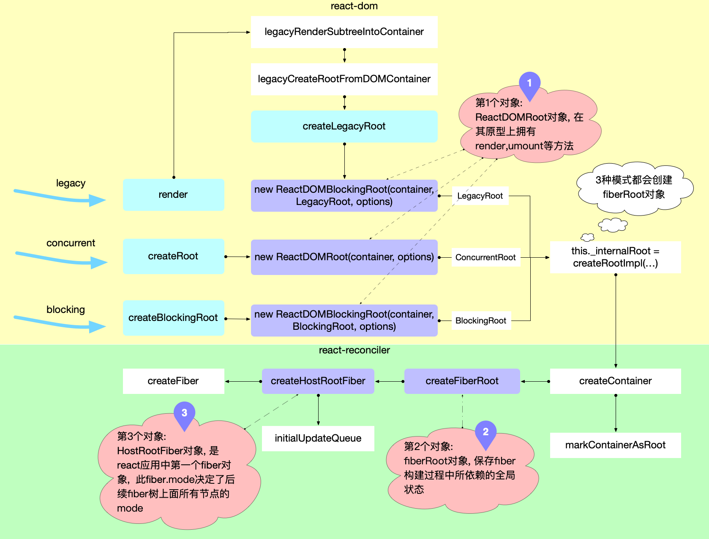

render => legacyRenderSubtreeIntoContainer => updateContainer

```javascript
// ... 省略了部分代码
export function updateContainer(
  element: ReactNodeList,
  container: OpaqueRoot,
  parentComponent: ?React$Component<any, any>,
  callback: ?Function,
): Lane {
  // 获取当前时间戳
  const current = container.current;
  const eventTime = requestEventTime();
  // 1. 创建一个更新通道，如果是render函数创建的 而不是 createRoot 那么都是同步更新通道
  const lane = requestUpdateLane(current);

  // 2. 根据通道优先级, 创建update对象, 并加入fiber.updateQueue.pending队列
  const update = createUpdate(eventTime, lane);
  update.payload = { element };
  callback = callback === undefined ? null : callback;
  if (callback !== null) {
    update.callback = callback;
  }
  enqueueUpdate(current, update);

  // 3. 进入reconciler运作流程中的`输入`环节
  scheduleUpdateOnFiber(current, lane, eventTime);
  return lane;
}
```
在循环中，每次都会执行到 performUnitOfWork
```javascript
function performUnitOfWork(unitOfWork: Fiber): void {
  // The current, flushed, state of this fiber is the alternate. Ideally
  // nothing should rely on this, but relying on it here means that we don't
  // need an additional field on the work in progress.
  const current = unitOfWork.alternate;
  setCurrentDebugFiberInDEV(unitOfWork);

  let next;
  if (enableProfilerTimer && (unitOfWork.mode & ProfileMode) !== NoMode) {
    startProfilerTimer(unitOfWork);
    next = beginWork(current, unitOfWork, subtreeRenderLanes);
    stopProfilerTimerIfRunningAndRecordDelta(unitOfWork, true);
  } else {
    next = beginWork(current, unitOfWork, subtreeRenderLanes);
  }

  resetCurrentDebugFiberInDEV();
  unitOfWork.memoizedProps = unitOfWork.pendingProps;
  if (next === null) {
    // If this doesn't spawn new work, complete the current work.
    completeUnitOfWork(unitOfWork);
  } else {
    workInProgress = next;
  }

  ReactCurrentOwner.current = null;
}
```
主要是beginWork和completeUnitOfWork
在 React 的 Fiber 架构中，`beginWork` 和 `completeUnitOfWork` 是两个核心函数，它们在渲染和更新过程中发挥着重要作用。下面是对这两个函数功能的总结：

### beginWork

`beginWork` 函数的主要职责是开始处理一个 Fiber 节点。它负责根据当前 Fiber 节点的状态和传入的 props 来决定这个节点以及其子节点需要进行的工作。`beginWork` 的主要任务包括：

1. **确定节点类型**：检查当前 Fiber 节点的类型（如类组件、函数组件、原生 DOM 元素等）。

2. **处理更新**：对于需要更新的节点，根据新的 props 和 state 计算出新的子节点。

3. **创建或更新子 Fiber 节点**：根据需要创建新的子节点的 Fiber 节点或更新现有的子节点。

4. **返回下一个工作单元**：`beginWork` 完成后，它会返回下一个要处理的工作单元（Fiber 节点）。这通常是当前节点的“最深”子节点，如果没有子节点，则返回兄弟节点。

`beginWork` 是渲染和更新过程的起点，它负责准备和构建 Fiber 树的结构。

### completeUnitOfWork

`completeUnitOfWork` 函数在一个 Fiber 节点的所有子节点都已经处理完毕之后被调用。它的主要作用是完成当前节点的工作，并根据需要进行额外的处理。`completeUnitOfWork` 的主要任务包括：

1. **调用生命周期方法或 Hooks**：如果节点是类组件或使用了 Hooks，调用相关的生命周期方法或 Hooks。

2. **处理副作用**：标记当前节点及其子节点的副作用（如 DOM 更新、ref 更新等）。

3. **构建副作用链**：为提交阶段（commit phase）构建副作用链。

4. **返回下一个工作单元**：如果当前节点有兄弟节点，返回兄弟节点作为下一个工作单元；否则，返回父节点。

`completeUnitOfWork` 是完成节点处理的关键步骤，它确保了副作用正确地被记录和处理。


### 总结

在 React 的 Fiber 架构中，`beginWork` 和 `completeUnitOfWork` 是协同工作的。`beginWork` 负责处理和构建 Fiber 节点及其子树的结构，而 `completeUnitOfWork` 负责完成工作并处理副作用。这两个函数在 React 的渲染和更新流程中扮演着核心角色，共同确保了高效和正确的 UI 更新。
fiber树的构建过程在文档中已经有了很好的图解，这里不在赘述
https://github.com/7kms/react-illustration-series/blob/main/docs/main/fibertree-create.md
fiber的以下会经常看到的属性释义：

1、stateNode 是 Fiber 节点的一个属性，它用来存储与该 Fiber 节点关联的实际 DOM 节点（对于原生 DOM 组件）或组件实例（对于类组件），对于函数组件为空。

2、alternate指向当前页面正在使用的fiber节点(联想双缓存模型，即正在更新的fiber节点通过alternate指向页面正在使用的fiber结点)

3、flags 属性是一个位字段（bit field），用于表示 Fiber 节点上的不同类型的工作或效果。具体见另一个md