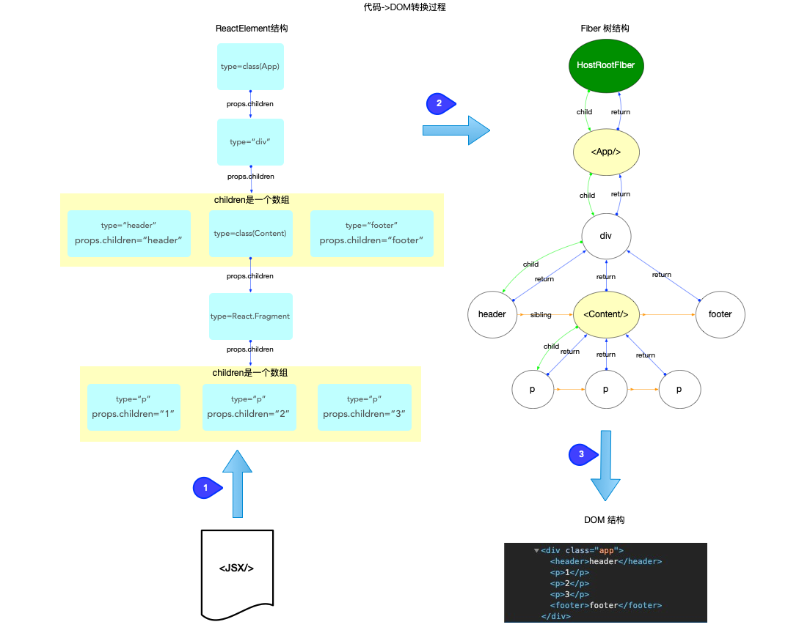
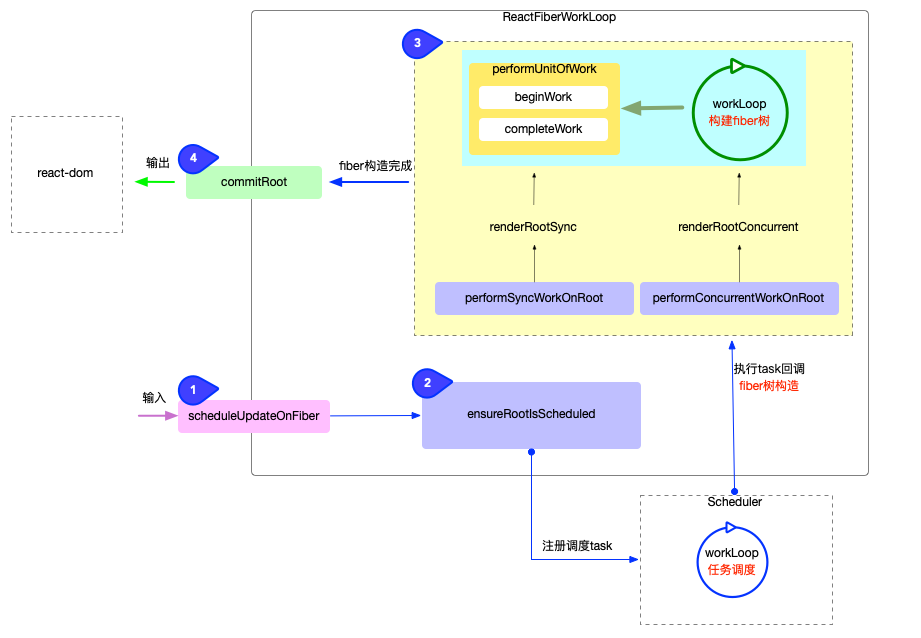

首先fiber的构建是在Reconciler中进行的

## 前置

首先babel会把jsx预发解析为js语法(由react.createElement包裹的函数调用)。而createElement的作用主要是创建一个ReactElement树出来，方便转换为fiber树(由createFiberFromElement函数进行转换，源码见 ReactFiber.new.js)。

## create

创建阶段通过循环的调用performUnitOfWork来构建，其中遍历顺序是先访问子节点，直到没有子节点了再看兄弟结点，通过一个指针(workInProgress)控制。

而每一次的循环会经历beginWork和completeWork。

### beginwork

beginwork主要是根据 ReactElement对象创建所有的fiber节点, 最终构造出fiber树形结构(设置return和sibling指针)。
通过ReactElement的children属性我们可以知道子元素，进而遍历生成。
设置fiber.flags(dom增、删和更新以及生命周期、hook和ref等)

### completeWork

而completeWork主要是创建dom实例(仅针对原生dom元素，react组件需要进一步做处理)以及添加每一个fiber结点的副作用到副作用队列中(副作用详细在另一篇文档中)。
根据fiber.flags，把当前fiber结点的副作用队列添加父节点的副作用队列中。

## update

更新启动于setState等API，在内部最终都会进入scheduleUpdateOnFiber函数。同样循环逻辑和构建时一致(performSyncWorkOnRoot--->renderRootSync--->workLoopSync)。同样最后会有两个阶段：beginWork、completeWork

### beginwork

和初次构造不同，因为已经有了结点，所以在更新的时候的重点主要在“对比”，即看是否可以复用，以及是否有要新增、更新和删除的dom。这里涉及到diff算法，这里diff算法只会设置fiber.flags标识，而不会实际进行新增、删除等操作。同时class组件的生命周期,function组件的hook等副作用操作也会在这一步放入

### completeWork

逻辑基本和create阶段一致，但是这里不会再去创建dom实例，而是会比对看是否需要更新dom。

## commit

前面无论是fiber树构建还是更新，fiber已经准备好了，接下来就是渲染或者说提交(commit)。
这棵将要被渲染的fiber树有 2 个特点:

1. 副作用队列挂载在根节点上(具体来讲是finishedWork.firstEffect)
2. 代表最新页面的DOM对象挂载在fiber树中首个HostComponent类型的节点上(具体来讲DOM对象是挂载在fiber.stateNode属性上，因为是dom根结点，所以是整个dom树的入口)

commit阶段做的事主要是：
1. 处理副作用队列.(副作用有Snapshot,Passive,Placement, Update, Deletion, Hydrating, Update, Callback)
2. 调用渲染器, 输出最终结果.
3. 检测常规(异步)任务, 如果有则会发起异步调度
4. 检测同步任务, 如果有则主动调用flushSyncCallbackQueue(无需再次等待scheduler调度), 再次进入fiber树构造循环

