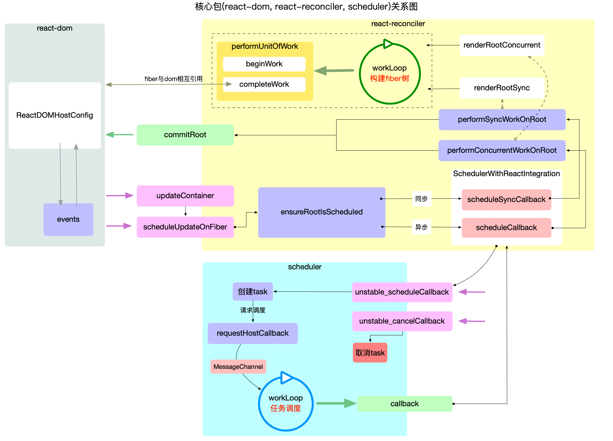

这里贴上大佬的整个流程概述图


需要注意几点

1、首先scheduleUpdateOnFiber并不一定会走ensureRootIsScheduled，如果是初始化构建fiber树(unbatchedUpdates的一种情况)，那么就会直接走performSyncWorkOnRoot，不会经过scheduler调度。所以下面完善一下调用链：

updateContainer

=> scheduleUpdateOnFiber

<(是否是同步lane)>

==是(且inside unbatchedUpdates且当前既不在渲染阶段也不在提交阶段。)==> performSyncWorkOnRoot => renderRootSync => workLoopSync

==其他情况==> ensureRootIsScheduled => 三种情况 SyncLanePriority、SyncBatchedLanePriority 和其他优先级

=>SyncLanePriority 是最高的优先级，用于同步更新。这意味着更新将立即执行，不会被中断。这通常用于处理紧急的更新，比如用户输入。

=>SyncBatchedLanePriority 用于处理同步但可以批量处理的更新。这种优先级比 SyncLanePriority 低，允许React将多个更新合并到一个批次中。

=>其他优先级 其他优先级通常用于并发模式（Concurrent Mode）下的更新，这些更新可以被中断和重新安排。这包括从最低优先级的空闲更新到各种级别的中等优先级更新。

2、scheduleSyncCallback和scheduleCallback都是通过react的scheduler来完成的，但是我们知道scheduler是有时间切片、可中断等机制的，如果我们把任务放到scheduler中 那么不也是并发了的吗。其实scheduleSyncCallback这个函数只是会把任务放到一个队列中(syncQueue)中，而第一次调用这个函数的同时会开启scheduler，放入一个任务，这个任务会清空syncQueue。因为只有一个任务，所以并不会被时间切片中断，因为时间切片是在每一个任务结束后才会判断的。[代码](https://github1s.com/facebook/react/blob/v17.0.2/packages/react-reconciler/src/SchedulerWithReactIntegration.new.js#L177)

```javascript
export function scheduleSyncCallback(callback: SchedulerCallback) {
  // Push this callback into an internal queue. We'll flush these either in
  // the next tick, or earlier if something calls `flushSyncCallbackQueue`.
  // flushSyncCallbackQueueImpl会清空syncQueue中的任务
  if (syncQueue === null) {
    syncQueue = [callback];
    // Flush the queue in the next tick, at the earliest.
    immediateQueueCallbackNode = Scheduler_scheduleCallback(
      Scheduler_ImmediatePriority,
      flushSyncCallbackQueueImpl,
    );
  } else {
    // Push onto existing queue. Don't need to schedule a callback because
    // we already scheduled one when we created the queue.
    syncQueue.push(callback);
  }
  return fakeCallbackNode;
}
```

### 最后

可以看到最终都会走到 renderRootSync 或 renderConcurrent(暂时省略这两个方法的分析)，会分别调用workLoopSync以及workLoopConcurrent

```javascript
function workLoopSync() {
  while (workInProgress !== null) {
    performUnitOfWork(workInProgress);
  }
}

function workLoopConcurrent() {
  // Perform work until Scheduler asks us to yield
  while (workInProgress !== null && !shouldYield()) {
    performUnitOfWork(workInProgress);
  }
}
```
可以看到区别在于 shouldYield，调用的是scheduler中的方法，用于判断是否到了时间切片的末尾。那么performUnitOfWork就涉及到fiber树构建的过程了，后续再来完整的学习fiber树构建的完成过程。