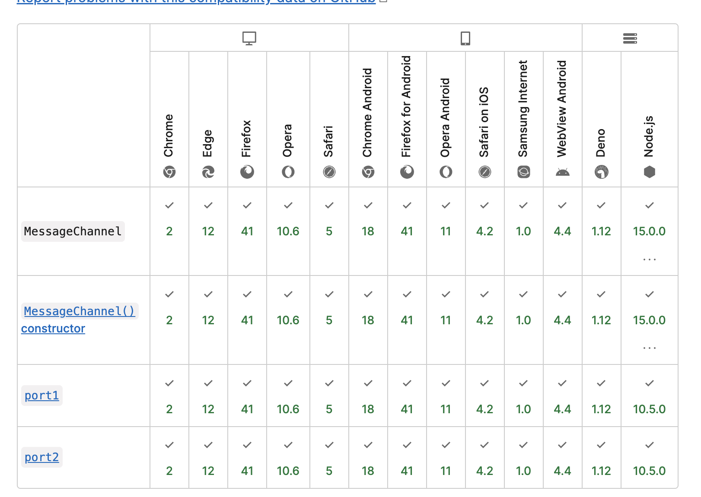

react的调度器学习笔记

# 前言

这篇文档主要讲react调度的流程，一是看完源码后需要整理思路，二是方便后续复习。

下面的代码是源码中删减了部分无关紧要的代码后的版本，主要是为了方便理解核心思想，避免受到干扰。

下面是阅读源码的时候记录的要点：

1. 最小堆的原理
2. 最小堆通过sortIndex排序
3. 调度器执行顺序：requestHostCallback => MessageChannel onmessage(performWorkUntilDeadline) => flushWork => workLoop
4. unstable_scheduleCallback是供外部调用 往队列中push任务的函数，根据任务开始时间判断是push到任务队列中还是计时器队列中

# 最小优先队列(最小堆)

首先，在了解调度器前得要了解react中实现最小优先队列的数据结构即最小堆。在另一篇笔记中有描述什么是最小堆，这里直接贴链接。

# 入口(scheduleCallback)

调度器的入口函数是在Schedule.js中的unstable_scheduleCallback(稍加注意 你会发现，导出的函数都带有了unstable_前缀，这是因为其当前的 API 尚非最终方案，因此其入口文件 Scheduler.js 所暴露出来的接口都带上了 `unstable_` 前缀)

```javascript
// 往队列里添加任务的函数
// 根据startTime 判断是push到timerQueue还是taskQueue中
function unstable_scheduleCallback(priorityLevel, callback, options) {
  var currentTime = getCurrentTime();
  // 初始化startTime
  var startTime;
  if (typeof options === 'object' && options !== null) {
    var delay = options.delay;
    if (typeof delay === 'number' && delay > 0) {
      startTime = currentTime + delay;
    } else {
      startTime = currentTime;
    }
  } else {
    startTime = currentTime;
  }
  // 根据优先等级 初始化timeout
  var timeout;
  switch (priorityLevel) {
    case ImmediatePriority:
      timeout = IMMEDIATE_PRIORITY_TIMEOUT;
      break;
    case UserBlockingPriority:
      timeout = USER_BLOCKING_PRIORITY_TIMEOUT;
      break;
    case IdlePriority:
      timeout = IDLE_PRIORITY_TIMEOUT;
      break;
    case LowPriority:
      timeout = LOW_PRIORITY_TIMEOUT;
      break;
    case NormalPriority:
    default:
      timeout = NORMAL_PRIORITY_TIMEOUT;
      break;
  }
  // 终止时间
  var expirationTime = startTime + timeout;

  var newTask = {
    id: taskIdCounter++,
    callback,
    priorityLevel,
    startTime,
    expirationTime,
    sortIndex: -1,
  };
  // 还不能立即开始执行
  if (startTime > currentTime) {
    // This is a delayed task.
    newTask.sortIndex = startTime;
    push(timerQueue, newTask); // 放入了计时器最小堆当中
    if (peek(taskQueue) === null && newTask === peek(timerQueue)) {
      // All tasks are delayed, and this is the task with the earliest delay.
      if (isHostTimeoutScheduled) {
        // Cancel an existing timeout.
        cancelHostTimeout();
      } else {
        isHostTimeoutScheduled = true;
      }
      // Schedule a timeout.
      requestHostTimeout(handleTimeout, startTime - currentTime);
    }
  } else {
    // 立即开始执行
    newTask.sortIndex = expirationTime;
    push(taskQueue, newTask);
    // Schedule a host callback, if needed. If we're already performing work,
    // wait until the next time we yield.
    if (!isHostCallbackScheduled && !isPerformingWork) {
      isHostCallbackScheduled = true;
      requestHostCallback(flushWork);
    }
  }

  return newTask;
}
```

这里可以看到函数的执行分为两段，if 和 else，第一个if是有delay的函数，而如果没有传入delay那么就是立即执行走else里的代码。

else里的代码比较简单，首先是把任务的sortIndex设置为过期时间，然后推入到任务队列中(这里的sortIndex是最小堆的排序优先级)，然后后面有两个变量判断，分别是isHostCallbackScheduled和isPerformingWork，这个我们现在可以先不管，可以根据注释和变量名理解为，这里是当没有正在进行中的其他任务的时候，我们则调用requestHostCallback开启我们的 工作循环(workLoop).

那么requestHostCallback这个函数是干嘛的呢，我们根据函数定义找到了SchedulerHostConfig.default.js这个文件。

```javascript
const channel = new MessageChannel();
  const port = channel.port2;
  channel.port1.onmessage = performWorkUntilDeadline;
  // 请求执行回调函数
  requestHostCallback = function(callback) {
    scheduledHostCallback = callback;
    if (!isMessageLoopRunning) {
      isMessageLoopRunning = true;
      port.postMessage(null);
    }
  };
```

我们看到了requestHostCallback这个函数的定义，但是要了解清楚这个函数是怎么运行的，我们还得了解清楚他的上下文是在干什么。首先，我们需要了解下MessageChannel这个API，我们要知道what(他是什么)，how(怎样使用的)以及why(为什么react要用它)。

## MessageChannel

MessageChannel是什么，这里我们贴上mdn的解释：

> Channel Messaging API 的 **`MessageChannel`** 接口允许我们创建一个新的消息通道，并通过它的两个 [`MessagePort`](https://developer.mozilla.org/zh-CN/docs/Web/API/MessagePort) 属性发送数据。

其实就是一个管道，他有两个端点，在一端说话，另一侧就能听到传过来的消息(message)：


messageChannel怎么用的呢，也很简单，在一个端口发送消息，另外一个端口就可以通过onmessage事件接收到。

```javascript
var channel = new MessageChannel();

channel.port2.postMessage('hh')

channel.port1.onmessage = handleMessage;
function handleMessage(e) {
  console.log('e', e);
}

```

最后是react为什么要使用messageChannel，那么我们得知道react主要是需要一个东西可以开启任务循环，同时满足以下要求：

1. 不阻塞渲染
2. 稳定
3. 兼容性好

首先第一点，我们可以排除微任务，因为我们知道微任务是在本次事件循环的最后，那么执行完毕后浏览器才会渲染，所以为了不阻塞渲染，我们应该采用宏任务。宏任务的话，我们有多个选择：setTimeout、requestAnimationFrame、requestIdleCallback。首先setTimeout我们都知道，即使设置为0，也会随着任务的增加，慢慢从执行间隔1ms变到4ms、6ms，以及浏览器实现各有差异，所以可以排除掉。而requestAnimationFrame的触发间隔时间不确定，如果浏览器间隔了 10ms 才更新页面，那么这 10ms 就浪费了，也可以排除掉。最后是requestIdleCallback，在空闲状态下，requestIdleCallback(callback) 回调函数的执行间隔是 50ms（W3C规定），也就是 20FPS，1秒内执行20次，那么肯定也是不行的。所以最后只剩下了messageChannel，并且messageChannel的兼容性很好。



## SchedulerHostConfig.default.js

然后我们回到SchedulerHostConfig.default.js的代码分析中，通过前面的代码我们可以知道，当没有任务在执行时会通过postMessage发起一次执行，但循环是怎么形成的呢，我们来看下onmessage执行的回调函数：

```javascript
const performWorkUntilDeadline = () => {
    if (scheduledHostCallback !== null) {
      const currentTime = getCurrentTime();
      // Yield after `yieldInterval` ms, regardless of where we are in the vsync
      // cycle. This means there's always time remaining at the beginning of
      // the message event.
      deadline = currentTime + yieldInterval;
      const hasTimeRemaining = true;
      try {
        const hasMoreWork = scheduledHostCallback(
          hasTimeRemaining,
          currentTime,
        );
        if (!hasMoreWork) {
          isMessageLoopRunning = false;
          scheduledHostCallback = null;
        } else {
          // If there's more work, schedule the next message event at the end
          // of the preceding one.
          port.postMessage(null);
        }
      } catch (error) {
        // If a scheduler task throws, exit the current browser task so the
        // error can be observed.
        port.postMessage(null);
        throw error;
      }
    } else {
      isMessageLoopRunning = false;
    }
    // Yielding to the browser will give it a chance to paint, so we can
    // reset this.
    needsPaint = false;
  };
```

可以看到，代码还是比较容易理解，当有回调函数的时候，我们则去执行回调函数，同时根据返回值(hasMoreWork是否还有任务)来判断是否继续执行performWorkUntilDeadline从而形成循环。

## workLoop

前面我们分析了工作循环是怎样形成的，接下来，我们回到Scheduler.js中，看每一次循环执行的是什么
根据上面的代码，我们知道每一次requestHostCallback都是去执行了flushWork

```javascript
function flushWork(hasTimeRemaining, initialTime) {

  // We'll need a host callback the next time work is scheduled.
  isHostCallbackScheduled = false;
  if (isHostTimeoutScheduled) {
    // We scheduled a timeout but it's no longer needed. Cancel it.
    isHostTimeoutScheduled = false;
    cancelHostTimeout();
  }

  isPerformingWork = true;
  const previousPriorityLevel = currentPriorityLevel;
  try {
    return workLoop(hasTimeRemaining, initialTime);
  } finally {
    currentTask = null;
    currentPriorityLevel = previousPriorityLevel;
    isPerformingWork = false;
  }
}
```

其实flushWork就是做一些准备工作，简单来说就是取消超时的任务，设置标识，以及开始workLoop(其他的cancelHostTimeout后续分析，我们现在先看最重要的workLoop)

```javascript
// 工作循环
// 返回值为 hasMoreWork
function workLoop(hasTimeRemaining, initialTime) {
  let currentTime = initialTime;
  advanceTimers(currentTime);
  currentTask = peek(taskQueue);
  // 对最小堆中的任务进行执行，直到任务队列都被清空 或 被暂停
  while (
    currentTask !== null &&
    !(enableSchedulerDebugging && isSchedulerPaused)
  ) {
    // 任务还没过期但是到了deadline，强制退出
    if (
      currentTask.expirationTime > currentTime &&
      (!hasTimeRemaining || shouldYieldToHost())
    ) {
      // This currentTask hasn't expired, and we've reached the deadline.
      break;
    }
    const callback = currentTask.callback;
    if (typeof callback === 'function') {
      currentTask.callback = null;
      currentPriorityLevel = currentTask.priorityLevel;
      const didUserCallbackTimeout = currentTask.expirationTime <= currentTime; // 任务是否超时
      const continuationCallback = callback(didUserCallbackTimeout);
      currentTime = getCurrentTime();
      // 如果函数返回值还是一个函数，那么不会从队列中pop
      if (typeof continuationCallback === 'function') {
        currentTask.callback = continuationCallback;
      } else {
        // 从队列中pop
        if (currentTask === peek(taskQueue)) {
          pop(taskQueue);
        }
      }
      advanceTimers(currentTime);
    } else {
      pop(taskQueue);
    }
    currentTask = peek(taskQueue);
  }
  // Return whether there's additional work
  // 主要是被暂停的情况才可能还会有任务，以及到达deadline的情况
  if (currentTask !== null) {
    return true;
  } else {
    const firstTimer = peek(timerQueue);
    if (firstTimer !== null) {
      requestHostTimeout(handleTimeout, firstTimer.startTime - currentTime);
    }
    return false;
  }
}
```

关于isHostCallbackScheduled和isPerformingWork，首先isHostCallbackScheduled比较好理解，会在requestHostCallback前标志为true，因为requestHostCallback是通过postmessage和onmessage执行的，这中间是有间隙的，完全又可能被重复执行，所以需要设计标识正在执行。而isPerformingWork呢，我们看到在workLoop之前会设置isPerformingWork为true，而try{...}finally{...}的finally中会改为false,所以他这里只能是防止同步任务重复调用workLoop，所以这里只能是一种情况——递归，即任务列表中有可能存在开启新的循环的子任务。
