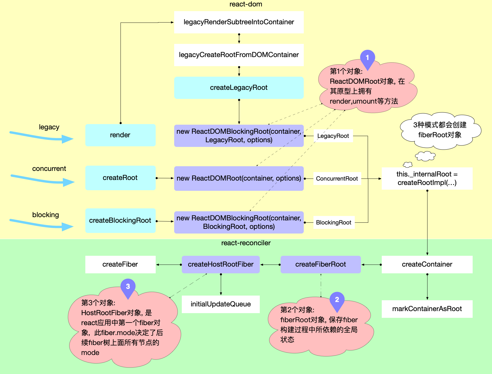

render => legacyRenderSubtreeIntoContainer => updateContainer

```javascript
// ... 省略了部分代码
export function updateContainer(
  element: ReactNodeList,
  container: OpaqueRoot,
  parentComponent: ?React$Component<any, any>,
  callback: ?Function,
): Lane {
  // 获取当前时间戳
  const current = container.current;
  const eventTime = requestEventTime();
  // 1. 创建一个更新通道，如果是render函数创建的 而不是 createRoot 那么都是同步更新通道
  const lane = requestUpdateLane(current);

  // 2. 根据通道优先级, 创建update对象, 并加入fiber.updateQueue.pending队列
  const update = createUpdate(eventTime, lane);
  update.payload = { element };
  callback = callback === undefined ? null : callback;
  if (callback !== null) {
    update.callback = callback;
  }
  enqueueUpdate(current, update);

  // 3. 进入reconciler运作流程中的`输入`环节
  scheduleUpdateOnFiber(current, lane, eventTime);
  return lane;
}
```
