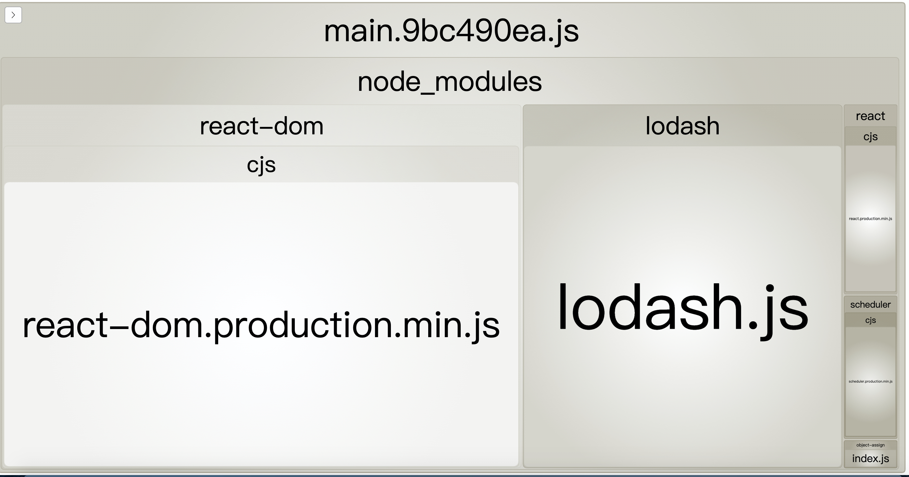
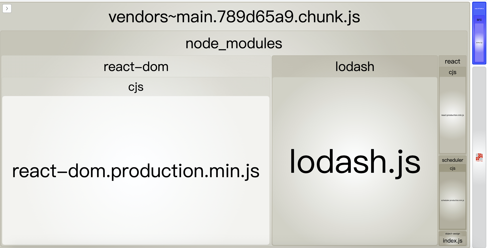
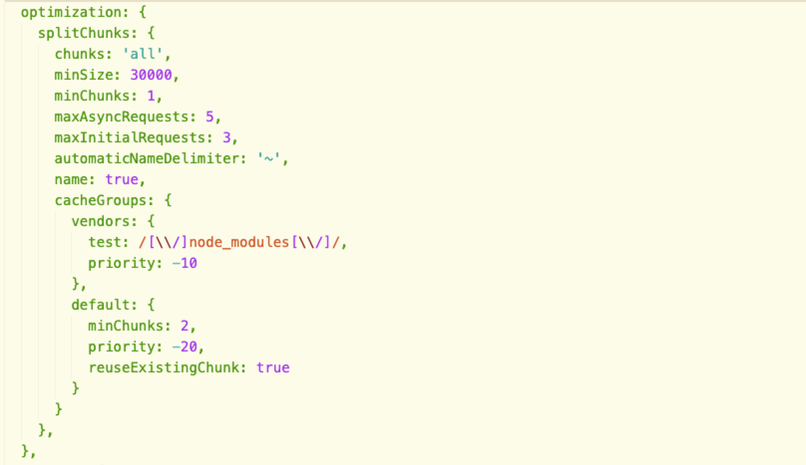
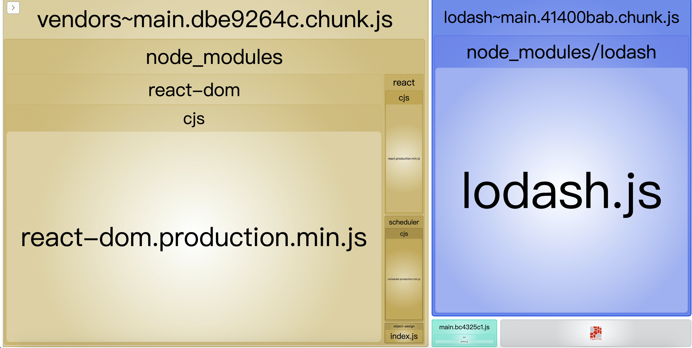
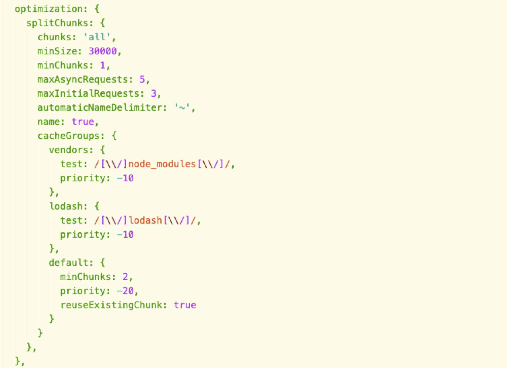

在umi配置splitChunks的时候按照文档的示例配置没有拆分出任何chunk来，后来发现是“minChunks”配大了的原因，遂了解记录下webpack splitChunks的配置项到底是什么意思。

首先要了解module、chunk、bundle这三个的概念：

module就是js的模块化webpack支持commonJS、ES6等模块化规范，简单来说就是你通过import语句引入的代码
chunk是webpack的特定术语，一般bundle由多个chunk组成
bundle就是最后打包生成的文件，有几个文件就是几个bundle
module比较好理解，但是chunk和bundle的关系好像不是很好理解，但是如果你的心智模型是这样的，就很好理解了：

bundle就是main.xxx.js，而chunk其实就是main.xxx.js中的lodash、react-dom。而splitChunks做的事情就是把这些chunk切割出来，配置了默认splitChunks后得到如下的结果：

chunks被切割出来后main.xxx.js 就变得很小了(右上角的蓝色矩形)。

所以一般bundle由多个chunk组成，但是也可以只由一个chunk组成(我们把lodash单独拆出来)：

这里的话，大概已经理解了chunk和bundle的概念了，但是配置splitChunks的时候的 chunk的来源只有两处：

入口文件，即webpack配置的entry。
异步加载的文件 即import()方法引入的文件。
只有这两种文件，才被当作minChunks(至少被几个chunk引用)中的chunk，所以minChunks其实是指：cacheGroup至少被几个入口文件或异步加载文件引用。

提到的minChunks和cacheGroup都是splitChunks中的配置，可以看下面的splitChunks默认配置。

module.exports = {
  //...
  optimization: {
    splitChunks: {
      chunks: 'async', // 这个配置决定chunk的类型，有'all'，'initial'，'async'三种类型的值，也可以为函数。
      minSize: 20000, // 最小体积，即只有超过了这个大小 才会被切割出来
      minRemainingSize: 0,
      maxSize: 0, // 0表示不限最大
      minChunks: 1,// 最小chunk数，即一个 cacheGroup 被至少x个chunk引用时才会被切割出来
      maxAsyncRequests: 30,
      maxInitialRequests: 30,
      automaticNameDelimiter: '~',
      enforceSizeThreshold: 50000,
      cacheGroups: { // cacheGroups定义如何从chunks中抽离代码。
        defaultVendors: {
          test: /[\\/]node_modules[\\/]/, // 匹配规则，也可以为函数，详细见下面
          priority: -10,
          reuseExistingChunk: true
        },
        default: { // 这个是默认的配置
          minChunks: 2,
          priority: -20, // 优先级
          reuseExistingChunk: true // 表示是否使用已有的 chunk，如果为 true 则表示如果当前的 chunk 包含的模块已经被抽取出去了，那么将不会重新生成新的。
        }
      }
    }
  }
};
chunks的三个值 async表示只有异步的模块会被抽离出来，initial表示只从入口模块进行拆分，all则表示拆离出来的模块即包括异步的也包括其他类型的。下面看一下网上提供的一个例子，更好理解：
（ps: splitChunks会默认把入口文件当成一个chunk，即如果配置了多个entry，就会有对应的多个chunk）
//app.js
import "my-statis-module";

if(some_condition_is_true){
  import ("my-dynamic-module")
}
console.log("My app is running")
asyn : (default)

Two files will be created.
1. bundle.js (includes app.js + my-statis-module)
2. chunk.js (includes my-dynamic-module only)

initial :

Three files will be created
1. app.js (inclues only app.js)
2. bundle.js (includes only my-static-module)
3. chunk.js (includes only my-dynamic-module)

all :

Two files will be created
1. app.js (includes app.js only)
2. bundle.js (includes my-static-module + my-dynamic-module)

 “all” 将会有从整体上来看最小的size(因为单独拆分成几个，可能会有重复的部分)。

到这里的话 splitChunks 比较关键的几个配置就讲的差不多了。

网上文章里经常讲到的webpack按需加载 要使用import()动态加载模块，但是却很多没提为什么要用import()才能实现异步加载，其实看过上面的splictChunks配置后，应该就知道了，是因为webpack4默认开启splitChunk，且chunks默认值为'async'，所以你异步加载的模块都会被分割出来，最后需要的时候才会去请求，所以按需加载就实现了。

umi里也有一个配置开启异步加载的功能，但是项目里却不需要使用import()，我猜测(umi源码没有开放)也是打包的时候帮我们改为从普通的import改为import()动态引入，所以最后才实现了按需加载。