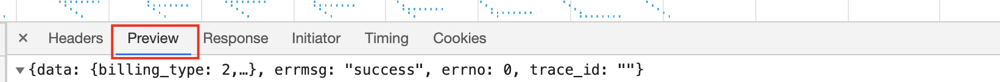
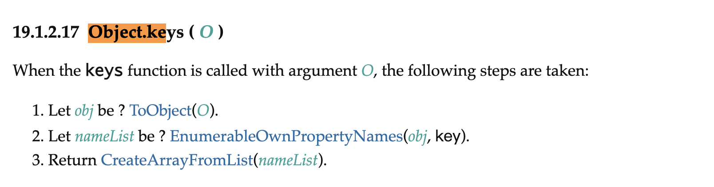
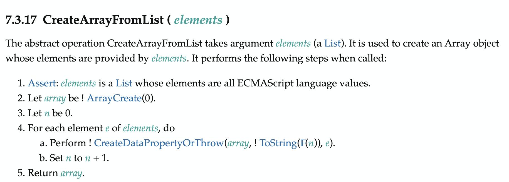
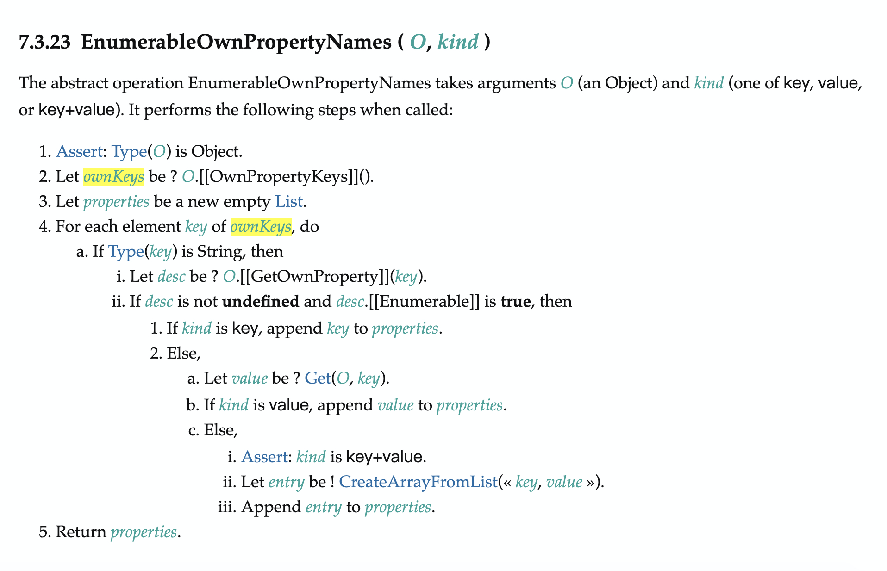
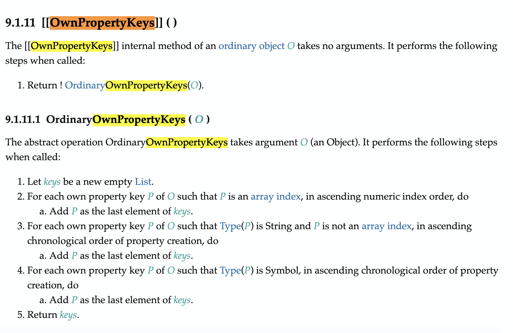

为什么要研究Object.keys 的返回顺序呢，起因是一个接口被重构过后，后端同学发现 接口返回“没变”但是前端的展示顺序 变了。刚开始，我也很迷惑，为什么输入一样，但是输出却不一样呢？

后来发现

是Preview惹的祸，Preview会把返回的字符串序列化一次，方便开发者看json结构，但是在序列化的时候，你就看不到http报文里是怎样返回的了，后来看了raw格式的数据发现，其实后端同学重构后的接口，和重构前的接口返回的数据确实key值顺序是不一致的，所以输入是不一致的，前端渲染的时候是根据Object.keys生成的数组渲染的，这导致了前端输出到界面的顺序也不一致。

但是Object.keys返回key值的顺序依据到底是什么呢？这点可以查看下ecma标准文档：

我们为解决问题，所以只看关键步骤

首先如上图所示，经历了三个阶段，第一步是调用ToObject方法把返回值命名为obj，然后第二步是调用EnumerableOwnPropertyNames(obj, key)返回值命名为nameList，第三步是调用CreateArrayFromList(nameList).

我们需要找到key值数组是怎么生成的，第二步看起来的nameList很像就是key数组，确认一下我们先看第三步调用的方法：

确实 参数就是一个数组，所以我们来看下这个nameList是怎么生成的：

我们看到其实这个方法也是在遍历一个数组做操作，这个数组就是wonKeys 来源于 对象的OwnPropertyKeys方法，我们在ecma文档里找一下这个方法：

ok，其实OwnPropertyKeys就是OrdinaryOwnPropertyKeys方法，里面根据key值的类型，处理方式不一样：

第一步如果key值是数组下标，那么就按照升序排序

第二步如果数组是字符串，那么就按照字符串的创建顺序排序

第三步如果是Symbol类型，和String类型一样，按照创建的顺序返回

所以我们可以得知，Object.keys返回的数组，数组下标会在最前面，然后是字符串，最后是Symbol类型，且他们按照各种的规则再排序。

最后，回到最开始的问题，接口返回的字符串的key值顺序不一样，导致了再创建这个对象的时候创建顺序不一致，Object.keys返回的顺序也就不一致了。

另外

Object.keys({
    '-1': '2',
    'test': 'haha',
    '1': '1',
    '2': '3',
})

返回["1", "2", "-1", "test"]是因为-1不能被当作数组索引，所以是被当作字符串处理的，事实证明，应该多看标准文档。

