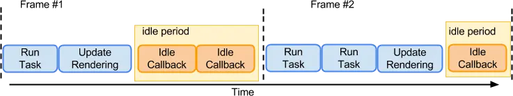

事件循环，需要明确的是一轮循环做了什么事，一轮只会取出一个宏任务执行，在宏任务执行完成后(js调用栈被清空)会去检测微任务队列并清空。
一些注意点：
* 任务队列不止一个，会有多个，且用户交互的任务队列优先级是更高的
* 在一帧中 可能会执行多次宏任务，且在每帧的末尾 正常情况下浏览器会进行渲染。但是如果你的任务执行耗时很长，可能会导致这一帧不会渲染更新，从而用户视觉上出现卡顿现象

* 在一帧中 同一类型的事件 只会被处理一次(如不停地滚动滚动条，但是一帧只会处理一次滚动事件)
* requestAnimationFrame 是在每帧渲染前的最后调用
* requestIdleCallback 会在宏任务、微任务队列都为空时且渲染后 去执行
* 从执行优先级上来看 微任务 > requestAnimationFrame > 宏任务 > requestIdleCallback

事件循环的规范：https://html.spec.whatwg.org/multipage/webappapis.html#window-event-loop
文章：https://juejin.cn/post/7233762589720117303/