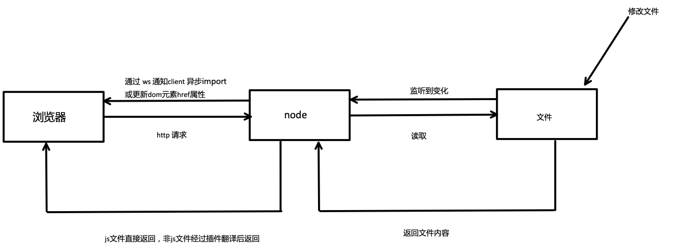
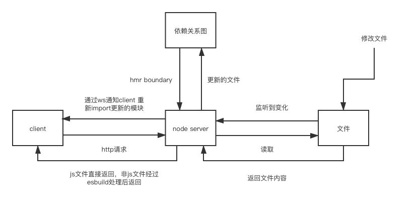
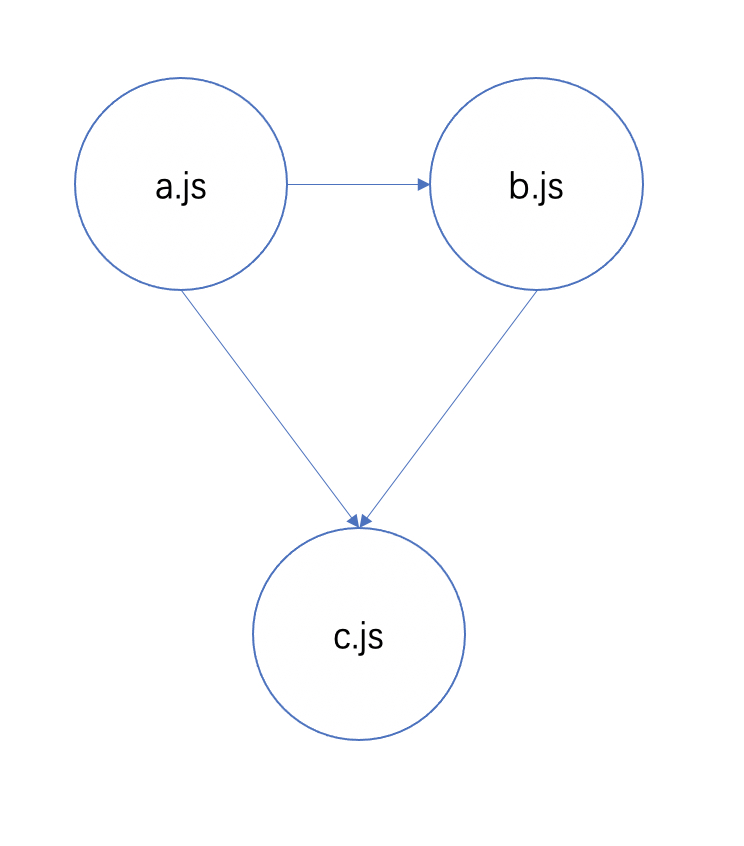
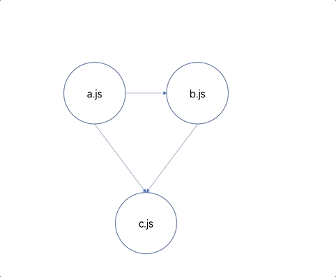
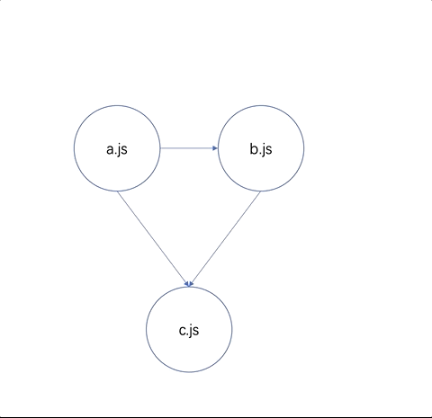
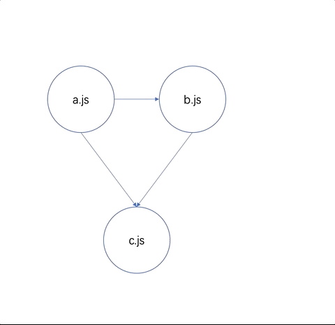

## 什么是热更新
热更新全称是Hot Module Replacement即热模块替换


简单来说就是更新的时候只替换更新的模块，而不会整个页面重新装载。热更新对于开发体验有很大的提升，而且对于中后台来说，如果没有热更新，那么只是更新一处文案都会使得整个表单重新装载导致表单得重新填写，体验会很差。
所以对于webpack以及vite来说，面向应用的打包工具，热更新都是很必要的，那vite是怎样实现热更新的。

## vite的热更新是怎么工作的
下面是一个热更新整体的概述



简单来说的话就是vite通过chokidar监听文件变化，然后websocket主动通知出发浏览器更新，发起import请求拉取最新的js模块文件。(同时，这是vite和webpack热更新的一个区别，因为vite不需要打包，所以热更新不是像webpack一样打补丁的形式，而是直接import最新的js模块就行了，相比起来更简洁明了)

但是这个概述的流程有一个问题: 根据你修改的文件不同，可能要更新的文件也会有变化，浏览器是怎么知道应该去重新请求哪些文件。


其实在vite知道修改的文件后，node server内部还有一些操作：

1、当某一个文件改变，会顺着importer链路找 “HMR boundary”。 HMR boundary是一个调用了import.meta.hot API的文件。(在启动的时候，所有的js文件在被返回前，会被重写import路径，同时会记录下依赖关系图，这里就是importer链路)

2、如果一直到importer链路的尽头都没能找到 HMR boundary，则其需要页面重载，即full-reload。

3、如果找到了HMR boundary ，我们要分几种情况：

1）该HMR boundary接受自身的更新，那么可以直接热更新该HMR boundary。

2）如果不接受自身的更新，那么他的importers都必须要接受他。


4、顺着上面的思路，找到所有的HMR boundary，往客户端发送这些HMR boundary的请求路径，客户端进行重新异步import，引入最新文件。

完整流程图


```javascript
if (importers || isHmrAccepted(publicPath, publicPath)) {
  const hmrBoundaries = new Set<string>()

  const hasDeadEnd = walkImportChain(
    publicPath,
    importers || new Set(),
    hmrBoundaries,
  )

  const relativeFile = '/' + slash(path.relative(root, filePath))
  if (hasDeadEnd) {
    send({
      type: 'full-reload',
      path: publicPath
    })
    console.log(chalk.green(`[vite] `) + `page reloaded.`)
  } else {
    const boundaries = [...hmrBoundaries]
    const file =
      boundaries.length === 1 ? boundaries[0] : `${boundaries.length} files`
    console.log(
      chalk.green(`[vite:hmr] `) +
        `${file} hot updated due to change in ${relativeFile}. ${getLocalTime()}`
    )
    send({
      type: 'multi',
      updates: boundaries.map((boundary) => {
        return {
          type: boundary.endsWith('vue') ? 'vue-reload' : 'js-update',
          path: boundary,
          changeSrcPath: publicPath,
          timestamp
        }
      })
    })
  }
}
```

至此我们已经知道热更新的一个完整流程了，但是现在还没有解答热更新是怎样保留状态的，如果整个js文件被重新import，那么相当于重新执行这个js文件，这样的话并不能实现保留组件的状态，怎样实现组件的状态保留，那我们得了解下HMR Api。

## HMR Api
### HMR Api是什么
HMR Api，基本上，它只是模块说“当我导入的某个模块的新版本可用时，在我的应用程序中运行一个回调，这样我就可以用它做一些事情”的一种方式。

### HMR Api是怎么用的
Vite 通过特殊的 import.meta.hot 对象暴露手动 HMR API。
```javascript
//因为这里只会用到这三种api，所以只介绍这几种
interface ImportMeta {
  readonly hot?: {
    readonly data: any

    accept(): void//接受模块自己的更新，热更新事件传递过来后会从自己开始更新
    accept(cb: (mod: any) => void): void//接受模块的更新后 可以在回调函数里做一些处理
    accept(dep: string, cb: (mod: any) => void): void//模块也可以接受直接依赖项的更新，而无需重新加载自身
  }
}
```
我们来具体看看，这里用vite新建一个项目，不用任何框架。

我们可以看到，直接修改b文件，页面进行了刷新，但是我们加上hmr api后，页面在没有刷新的情况下更新了。这是因为 调用了import.meta.hot API的文件被标记为了 boundary，照着前面梳理的思路，当b文件改变，会顺着依赖关系图寻找 boundary，这里找到了a文件发现是hmr boundary(热更新边界)则a文件会被重新import，因为a依赖b，所以b也会重新被import。

当我们有三个文件，且当两个文件依赖于一个共同文件的时候：



a self accept:



a模块接受了自己的更新，更新了c模块后，依次往上询问，直到a模块，因为是接受自己的更新，所以会从自己开始更新，即a模块会被更新，因为重新引入了a模块，在执行a模块代码的时候又会重新import b、c模块。所以a、b、c都会更新。

如果a模块没有接受自身的更新，只是接受了依赖模块中的一个——c模块
那么：



页面会刷新，这种情况，如果按照之前的规律去热更新a依赖的c模块，但是b模块也依赖了c模块，却没有进行更新会导致页面不同步的情况，所以这种情况还是需要重新加载页面。

如果a和b模块都接受c模块的更新：



### 为什么需要HMR Api

因为提供了热更新Api的打包工具，提供了实现热更新的能力，任何第三方框架都可以通过HMR Api去实现自己的框架或工具库的热更新，无论是react或者vue以及sveltejs等等
并且因为有HMR Api我们就可以在回调函数的时候做一些事情，比如上面说的状态保留，这里可以在回调函数拿到更新前组件的状态传递给更新后的模块，以此可以实现组件状态的保存(至于每个框架vue、react怎么实现的组件状态保存，得了解下react-fresh以及vue-loader怎么实现的)。

## 总结

vite做为打包工具，有了esbuild的加持无论是本地开发体验以及线上打包都比webpack快上很多，随着标准的统一、浏览器的升级，ESM将会是以后的趋势，前端工具链的原生化也会是趋势。虽然vite还比较年轻，会有一些问题，老项目改造成本可能会比较大，但是在新项目里完全可以考虑使用vite，相信一定能给带来不一样的开发体验。


