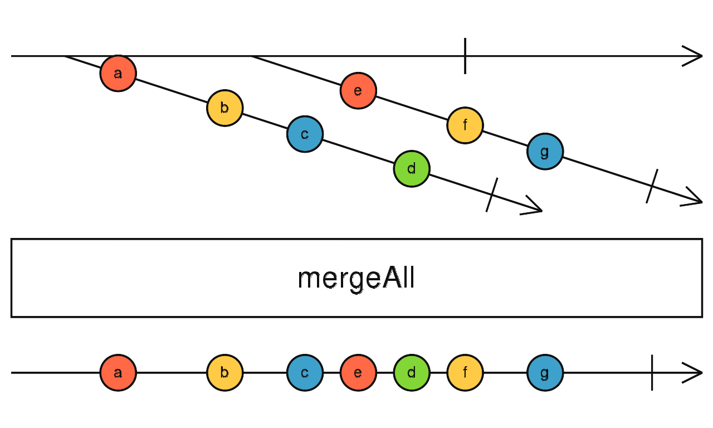

学习背景：
在阿里的formilyjs库中，监听表单生命周期、表单字段的onChange 都会返回一个rxjs的observable对象，通过订阅observable对象 来处理业务逻辑，或者控制表单的联动。

所以需要了解rxjs的理念以及常用的一些api，这是学习背景。

记录：
rxjs是一个处理异步事件的库，基于observable对象。

rxjs——Reactive Extensions for JavaScript

`可以把 RxJS 当做是用来处理事件的 Lodash 。`

rxjs的使用可以大概理解为 设置消息源，然后配置一个产出信息的管道流水线，后续每次消息源发出消息都会通过这个流水线加工生成你想要的信息，最后在订阅里消费。


消息源一般为 事件、计时器、数组、Promise或者自己控制产出消息等。
```javascript
//eg: 自己控制产出消息
var observable = Rx.Observable.create(function (observer) {
  observer.next(1);
  observer.next(2);
  observer.next(3);
  setTimeout(() => {
    observer.next(4);
    observer.complete();
  }, 1000);
});
// 来自一个或多个值
Rx.Observable.of('foo', 'bar');

// 来自数组
Rx.Observable.from([1,2,3]);

// 来自事件
Rx.Observable.fromEvent(document.querySelector('button'), 'click');

// 来自 Promise
Rx.Observable.fromPromise(fetch('/users'));

// 来自回调函数(最后一个参数得是回调函数，比如下面的 cb)
// fs.exists = (path, cb(exists))
var exists = Rx.Observable.bindCallback(fs.exists);
exists('file.txt').subscribe(exists => console.log('Does file exist?', exists));

// 来自回调函数(最后一个参数得是回调函数，比如下面的 cb)
// fs.rename = (pathA, pathB, cb(err, result))
var rename = Rx.Observable.bindNodeCallback(fs.rename);
rename('file.txt', 'else.txt').subscribe(() => console.log('Renamed!'));
//eg: 计时器
var timer1 = Rx.Observable.interval(1000).take(10);
var timer2 = Rx.Observable.interval(2000).take(6);
var merged = timer1.merge(timer2);
merged.subscribe(x => console.log(x));
```

高阶Observable 即——Observable<Observable<T>>，类似于高阶函数 经过函数包装过的函数。


Observable (可观察对象): 表示一个概念，这个概念是一个可调用的未来值或事件的集合。

Observer (观察者): 一个对象，包含next、complete、error三个属性，每个属性一个回调函数，在可观察对象到达相应状态时 调用相应回调函数。

Subscription (订阅)：可观察对象调用subscript方法返回的对象，方便取消订阅。

Subject (主体)：即相当于观察者又相当于可观察对象，可以订阅多个观察者，同时也可以作为多个观察者的集合被其他 可观察对象 订阅。


rxjs api很多 介绍常用的几个：

实例方法：

map: 用来从observable对象中取出源值，然后通过函数进行映射，把映射后的值再封装成observable对象。

mapTo: 传递常量，把所有项都统一映射为这个常量。

do: 不会直接参与链式操作，用来执行副作用，或者查看中间传递的值是多少，方便调试用。

mergeAll：把二阶Observable 拉平为一阶， 可理解为数组拉平函数flat。



switch: 我理解为切换轨道(ps:在mergeAll 把高阶转换成一阶的前提下)，一旦有新的可观察对象出现，则切换到新的Observable轨道上。

takeWhile: 控制信息的产出，当传入的函数返回false时，停止产出。

静态方法：

timer(x,y): 从x秒开始，每隔y秒产出一个信息。


一个栗子，让你更好的理解rxjs的使用：https://codesandbox.io/s/awesome-meitner-y49cb

