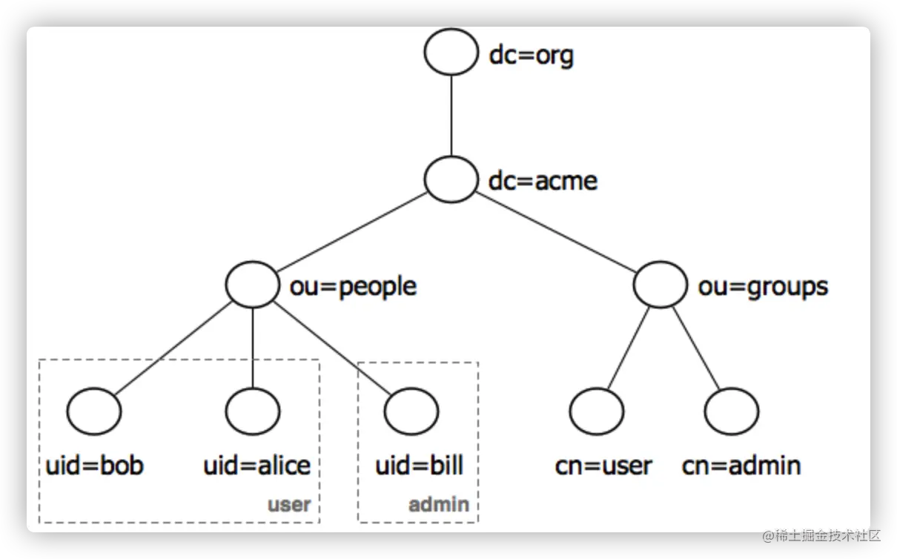

LDAP 全称为 Lightweight Directory Access Protocol, 轻量目录访问协议。简单地说， LDAP 就是用来访问目录数据库的一个协议。

那么什么是目录数据库呢？

```
目录数据库是一种特殊的数据库系统，它用于存储和组织有关网络环境中用户、资源和策略的信息。目录数据库通常用于存储关于网络中对象的描述和它们之间的关系，这些对象可以是用户、计算机、打印机、组织单位等。
````

所以目录数据库非常适合存储组织架构的用户信息

以下是 LDAP 在 SSO 流程中的一些作用：

* 集中存储用户信息：LDAP 服务器作为一个中心化的存储库，存储了用户的身份信息，包括用户名、密码、电子邮件地址、组成员身份等。

* 身份验证：在 SSO 流程中，用户首先向身份提供者（IdP）进行身份验证。如果 LDAP 被用作身份存储，用户凭据（如用户名和密码）将被发送到 LDAP 服务器进行验证。

* 权限和组成员管理：LDAP 目录可以包含复杂的数据结构，例如组织单位（OU）、组和其他属性，这些可以用于确定用户对资源的访问权限。

* 减少密码管理：通过 LDAP，用户只需记住一组登录凭证，就可以访问多个系统和服务，因为 LDAP 可以作为多个应用程序和服务的认证源。

* 同步和更新用户信息：LDAP 目录可以与其他系统同步用户信息，确保用户数据的一致性和最新状态。

* 细粒度访问控制：LDAP 支持访问控制列表（ACLs），允许管理员定义细粒度的访问规则，控制用户对目录中特定数据的访问。

* 跨域身份验证：在跨域或跨组织的 SSO 场景中，LDAP 可以作为信任的基础，允许不同域的用户访问共享资源。

* 与其他 SSO 协议集成：LDAP 可以与其他 SSO 技术（如 SAML、OAuth）集成，提供用户身份验证和属性信息。

* 审计和日志记录：LDAP 服务器可以记录对目录的访问和更改，有助于审计和监控用户活动。

* 可扩展性和性能：LDAP 目录服务设计为可扩展的，能够处理大量用户和请求，适合大型组织的需求。