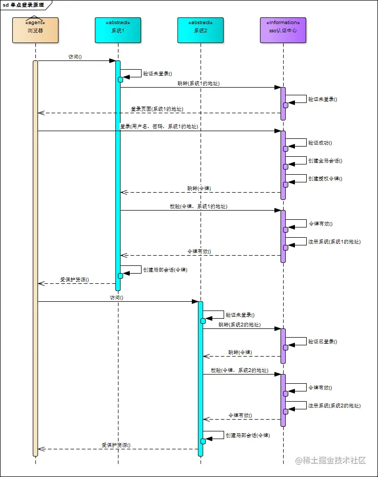

单点登录英文全称Single Sign On，简称SSO。
sso的流程如下：

这其中有几个问题：

1、为什么sso流程中需要code？

首先，单点登录的登录页面是统一的，在流程中可以看到，如果发现没有登录，那么会重定向到sso的登录页面。那么显然这个sso登录页面交互的后端是sso认证中心，当用户输入用户名/密码 点击登录后，会往sso认证中心发起请求(在公司内部 会通过LDAP 验证用户信息)，登录信息认证通过后，需要返回一个凭证信息，因为当前还在sso登录页面，需要重定向到子系统页面，这里302重定向需要传递凭证信息，一般是放到url中，所以这里肯定不能放最终的ticket，因此有了授权码，有了授权码后，页面会重定向到之前记录的callback url，访问子系统的后端服务，并且捎带上了code。

2、 用户信息的缓存和过期?

一般有了ticket后，都需要通过session存储ticket，以便下次访问时不再走登录流程。这里的session存储，在服务端一般有两种方式：内存和数据库。简单情况直接存储在内存中，但如果用户量过大还是存储在数据库中合适，比如redis。(比如俺司ticket缓存时间为5小时，且过期后如果距离上次登录时间没超过24h，是不需要重复登录的，会重新下发一个ticket，但是得重新走一次code和ticket的流程)