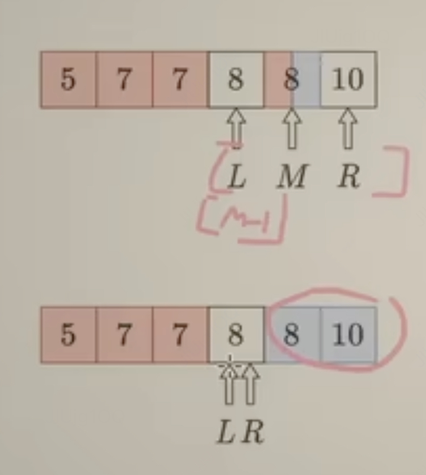

二分查找和快速排序虽然逻辑不复杂，但是边界条件比较难写好，所以做一个记忆
### 二分查找
在二分查找算法中，循环条件使用 left <= right 而不是 left < right 的原因是为了确保在查找过程中能够正确处理数组的边界情况，特别是当 left 和 right 指向同一个元素时。

考虑以下两种情况：

* 数组中只有一个元素：如果使用 left < right 作为条件，当 left 和 right 都等于 0 时，循环将不会执行，因为 0 < 0 是不成立的。但是，如果使用 left <= right，那么 0 <= 0 是成立的，循环将执行一次，这是有意义的，因为数组中只有一个元素，这是需要检查的情况。

* 目标值等于数组中的最后一个元素：在二分查找中，如果目标值等于数组中的最后一个元素，我们希望算法能够返回这个元素的正确索引。如果使用 left < right，当 left 和 right 都指向最后一个元素时（即 left == right），循环将不会执行，因为 left 不小于 right。但是，如果使用 left <= right，循环将执行，并且能够正确地找到目标值的索引。

如下面这种情况，l === r的时候如果不判断可能就会漏掉


同时在l===r的时候如果，left没有经过mid+1，或者right不经过mid-1，那么则会造成死循环

```javascript
function searchInsert(nums, target) {
    let left = 0;
    let right = nums.length - 1;
    while (left <= right) {
        // 使用 Math.ceil() 替代 Math.floor()
        const mid = left + Math.floor((right - left) / 2);
        if (nums[mid] === target) {
            return mid;
        } else if (nums[mid] < target) {
            left = mid + 1;
        } else {
            right = mid - 1;
        }
    }
    return left;
}
```
### 快速排序
快速排序用快慢指针版本比较好记忆。
每当快指针扫描到小于等于pivot的元素，就将这个元素丢到慢指针的位置（同时慢指针增加）。慢指针指向的元素以及其左边的元素，全都是被快指针丢过来的（也就是小于等于pivot的）。
```javascript
function swap(arr, i, j) {
    let temp = arr[i];
    arr[i] = arr[j];
    arr[j] = temp;
}

function qsort(vec, low = 0, high = vec.length - 1) {
    if (low > high) return;

    let slow = low, pivot = vec[low];
    // 要对**除了主元的所有元素**进行划分，因此循环的边界很好理解
    for (let fast = low + 1; fast <= high; ++fast) {
        if (vec[fast] <= pivot) {
            slow++;
            swap(vec, slow, fast);
        }
    }
    swap(vec, low, slow);// 划分完成后再将主元放到其最终位置

    qsort(vec, low, slow - 1); // vec[slow]（即主元）不需要参与排序，因为它已经处于正确位置
    qsort(vec, slow + 1, high);
}

// 使用示例
let vec = [3, 7, 1, 5, 2];
qsort(vec);
console.log(vec); // 输出排序后的数组

```