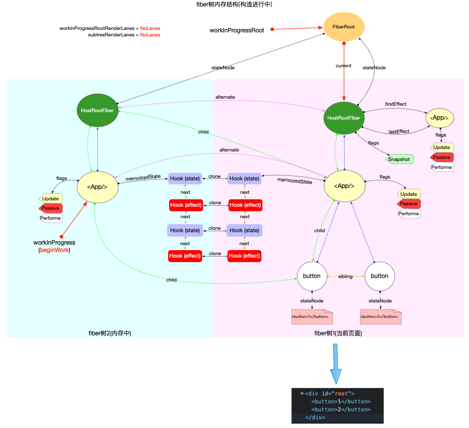

对于一个函数组件，大部分原生Hook的数据会保存在一条单向链表中（这也是不能在条件语句中写 Hooks的原因），通过链表这种有序结构更方便实现状态管理。
如图所示，通过fiber的memoizedState属性可以访问到hook链表。

那么为什么要用链表结构实现hook呢？如果说用链表实现组件树还好理解，既为了暂停和恢复，那么这里为什么也要用链表呢？
我们来看如下代码
```javascript
function updateWorkInProgressHook(): Hook {
  // 1. 移动currentHook指针
  let nextCurrentHook: null | Hook;
  if (currentHook === null) {
    const current = currentlyRenderingFiber.alternate;
    if (current !== null) {
      nextCurrentHook = current.memoizedState;
    } else {
      nextCurrentHook = null;
    }
  } else {
    nextCurrentHook = currentHook.next;
  }

  // 2. 移动workInProgressHook指针
  let nextWorkInProgressHook: null | Hook;
  if (workInProgressHook === null) {
    nextWorkInProgressHook = currentlyRenderingFiber.memoizedState;
  } else {
    nextWorkInProgressHook = workInProgressHook.next;
  }

  if (nextWorkInProgressHook !== null) {
    // 渲染时更新: 本节不讨论
  } else {
    currentHook = nextCurrentHook;
    // 3. 克隆currentHook作为新的workInProgressHook.
    // 随后逻辑与mountWorkInProgressHook一致
    const newHook: Hook = {
      memoizedState: currentHook.memoizedState,

      baseState: currentHook.baseState,
      baseQueue: currentHook.baseQueue,
      queue: currentHook.queue,

      next: null, // 注意next指针是null
    };
    if (workInProgressHook === null) {
      currentlyRenderingFiber.memoizedState = workInProgressHook = newHook;
    } else {
      workInProgressHook = workInProgressHook.next = newHook;
    }
  }
  return workInProgressHook;
}
```
updateWorkInProgressHook，会在每次hook组件更新时被调用，无论是useState还是useEffect都会调用这个函数，来进行clone。而其中主要用到了链表特点的一行代码则是：
```javascript
workInProgressHook = workInProgressHook.next = newHook
```
这里是在往尾部插入节点的同时移动的代码，那么其实用数组来实现也差别不大，关键点在于workInProgressHook这个指针，在react里有很多指针，我理解这里是为了配合整体的实现方式(双缓存模型的workInProgress和current)，所以这里也是workInProgressHook和currentHook，并且指针和链表更灵活。