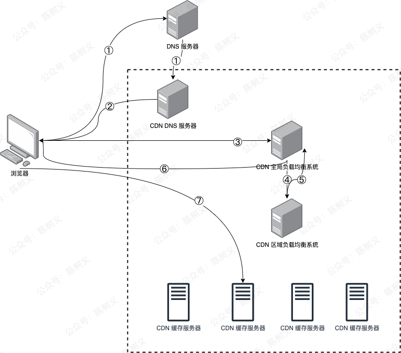

## CDN工作原理

1. 浏览器发起图片 URL 请求，经过本地 DNS 解析，会将域名解析权交给域名 CNAME 指向的 CDN 专用 DNS 服务器。
2. CDN 的 DNS 服务器将 CDN 的全局负载均衡设备 IP 地址返回给浏览器。
3. 浏览器向 CDN 全局负载均衡设备发起 URL 请求。
4. CDN 全局负载均衡设备根据用户 IP 地址，以及用户请求的 URL，选择一台用户所属区域的区域负载均衡设备，向其发起请求。
5. 区域负载均衡设备会为用户选择最合适的 CDN 缓存服务器（考虑的依据包括：服务器负载情况，距离用户的距离等），并返回给全局负载均衡设备。
6. 全局负载均衡设备将选中的 CDN 缓存服务器 IP 地址返回给用户。
7. 用户向 CDN 缓存服务器发起请求，缓存服务器响应用户请求，最终将用户所需要偶的内容返回给浏览器。
## 问题
### 第一次请求CDN和后续请求CDN的流程一样吗？
不一样。第一次请求，需要走全局负载均衡设备(离用户的物理距离还是比较远的)，以及智能路由等流程，这个流程相比用户直接请求源站还是有额外耗时的，但是第一次找到CDN缓存服务器后，后续用户访问都只需要访问这个CDN缓存服务器就行了，并且这个CDN缓存服务器一般都是离用户最近的服务器。
### 如何解决用户第一次访问CDN比较慢的问题
缓存预热
