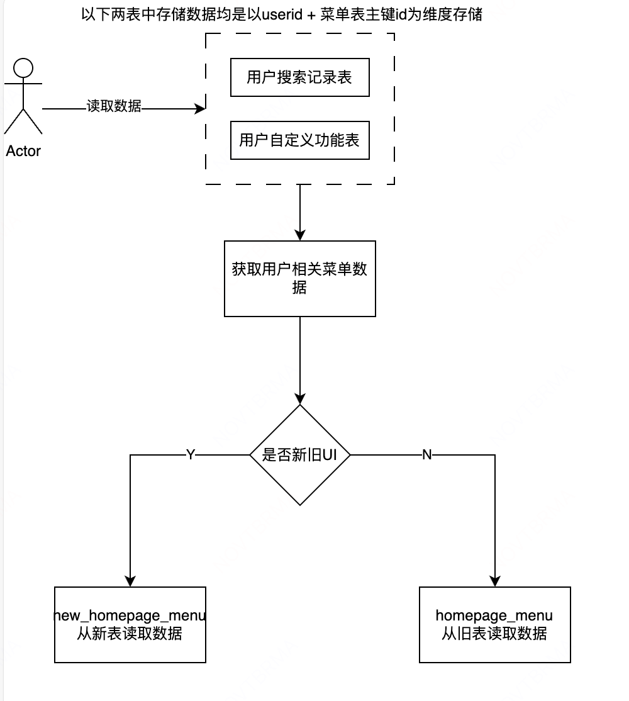
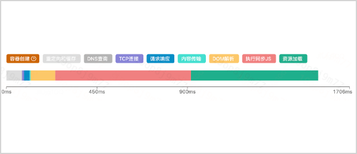

# 宏鹄中的难点
## 菜单配置化
方案设计：第一次设计整体方案(前后端)，需要考虑的点比较多：
    * 数据隔离方案，和后端沟通有gap
    * 新的菜单结构和之前不同，所以路由路径不同，需要梳理代码里用到的路由，进行整体替换
    * 新旧菜单过渡阶段(两个分支、部署到两个模块、两个域名路径)
    * 菜单的权限点key 和 路由路径一致，同步需要配置新的菜单权限点，且旧角色需要绑定新权限点
解决方案：
    * 前期统一梳理，新旧菜单的映射，以及相关的属性，根据梳理的excel文档，编写node脚本，可批量导入数据到对应系统中
    * 方案上和后端的沟通有Gap，前期多次沟通无果，后端要求加排期，重新拉了对方+1级，沟通没问题后，确认了数据隔离方案，且对整体工作量影响不大
    * 最终数据隔离方案是，新建一个表来存储新菜单数据(主要用于提供菜单搜索功能和设置常用)，然后在菜单搜索历史表中会同时存储旧菜单数据和新菜单数据
    * 新菜单权限点的变化，需要对历史已有角色重新勾选和透传商家对自己的自定义角色进行勾选
    
如何做的更好：
在本次菜单重构中，作为rd owner过技术方案实际上只过了前端和node的部分，对后端部分没有提前拉齐，后端过技术方案的时候也有遗漏，但是没有发现，实际是在线下沟通的时候发现有遗漏
对所要承担的角色认知不够清晰
作为rd owner，在前期方案要设计充分，在过技术方案评审的时候，尽可能要提前拉齐多方，且如果没有讨论清楚不应该急着开始
## 性能优化
参考ppt
主要难点应该是性能分析 和 webpack插件开发
### 性能分析
在经过常规的性能优化措施后：cdn、http2、webp、包体积优化、缓存等后，依然没能达到3s以下，再次进行分析，发现接口阻塞和首页加载没有前置的问题，再次进行了优化后，达到了目标
### 性能监控
通过监控performance的各项指标，比如监控初始化加载js阻塞时间90分位、资源加载时间90分位、dom解析时间90分位、重定向时间90分位、dns查询时间90分位等等

### webpack插件开发
如何找到react.createElement(关键词：非自由变量、HarmonyImportDependencyParserPlugin.harmonySpecifierTag)
